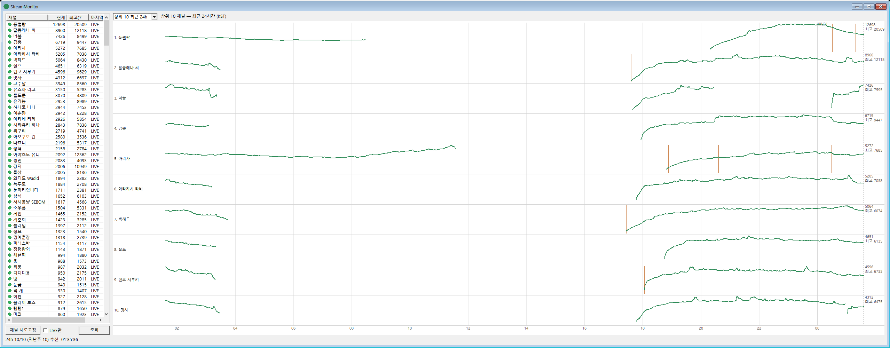

# StreamMonitor

어떤 콘텐츠가 시청자를 유입시켰는지 보기 위한 치지직(CHZZK) 시청자 분석 도구입니다.
라이브 상위 채널의 시청자 수와 제목·카테고리 변경을 매분 기록하고, 지난주 같은 요일·같은 시각과
나란히 놓아 콘텐츠 전환 전후의 변화를 봅니다. 리눅스(Oracle Cloud)에서 24시간 수집하고,
윈도우 MFC 앱이 SSH 터널로 붙어 차트를 그립니다.

```
┌─ Linux (Oracle Cloud) ───────────────────┐        ┌─ Windows ─────────────────────┐
│  collector  ── CHZZK Open API 매분 상위 50 │        │                               │
│      │ SQLite (WAL)                      │  SSH   │                               │
│      ▼                                   │◀─터널─▶│  StreamMonitor (MFC)          │
│  push  ── 127.0.0.1:9002 줄 단위 JSON      │  9002  │                               │
└──────────────────────────────────────────┘        └───────────────────────────────┘
```

프로세스는 세 개이고 역할이 겹치지 않습니다.

| 프로세스 | 어디서 | 역할 | DB 접근 |
|---|---|---|---|
| **collector** (`sm_collector`, C++) | 서버, systemd `streammonitor` | 매분 치지직 API 를 호출해 상위 50개 방송의 시청자 수를 SQLite 에 기록 | **쓰기 (유일)** |
| **push** (`sm_push`, C++) | 서버, systemd `streammonitor-push` | 클라이언트 요청을 받아 DB 를 읽어 JSON 으로 응답. `127.0.0.1:9002` 에만 바인딩 | 읽기 전용 |
| **client** (MFC) | 윈도우 PC | SSH 터널을 띄워 push 에 접속, 채널 목록과 2주 시계열을 받아 차트로 표시 | 없음 |

서버 데몬은 `src/cpp/` 의 C++ 판이 운영 중이고, `src/collector/`·`src/push/` 의 Python 판은 같은 동작을 하는
참조 구현으로 남겨 둡니다 (로컬 테스트, 롤백용). 빌드·배포는 `./deploy.sh cpp`.

## 클라이언트 화면

### 상위 10 최근 24h 모드



좌측 리스트(현재 시청자순, LIVE 필터 가능)의 앞 10개 채널을 한 줄씩 나열합니다. x 축은 `지금 − 24h ~ 지금`
(KST, 자정 경계 표시, 점선 = 현재 시각), 줄마다 y 축은 자기 최고치. 주황 눈금은 제목/카테고리 변경 시각,
오른쪽은 `현재 / 최고`. 지난주 같은 24시간이 있으면 회색으로 겹쳐 그립니다. 1분마다 갱신되고, 마우스를 올리면
그 시각의 시청자수와 `카테고리 | 제목` 툴팁이 뜹니다.

### 채널 2주 분석 모드

선택한 채널 하나를 위 줄 = 지난주, 아래 줄 = 이번주(일~토 고정 폭)로 그리고, 아래 줄에 지난주를 회색으로
겹칩니다. 제목/카테고리 변경 지점에는 리더 라인으로 연결된 2줄 라벨(카테고리 / 제목)이 붙습니다.

## DB 스키마 (SQLite)

파일 하나(`monitor.db`, WAL 모드)에 테이블 세 개. 쓰기는 collector 만, push 는 `mode=ro` 로 엽니다.
정의는 [`src/collector/chzzk/schema.sql`](src/collector/chzzk/schema.sql), 비교 쿼리 예시는 [`queries.sql`](src/collector/chzzk/queries.sql).

### `viewer_samples` — 시청자 수 시계열 (매분 상위 50행)

| 컬럼 | 타입 | 설명 |
|---|---|---|
| `channel_id` | TEXT | 치지직 channelId |
| `ts` | INTEGER | 관측 시각, UTC epoch 초. **60초 단위로 내림** (`now // 60 * 60`) |
| `viewers` | INTEGER | `concurrentUserCount` |

PK `(channel_id, ts)`, `WITHOUT ROWID`. 보조 인덱스 `ts`.
`ts` 가 60의 배수라 1주 전 같은 요일·시각은 `ts - 604800` 행 하나와 정확히 매칭됩니다:

```sql
SELECT a.ts, a.viewers AS now, b.viewers AS last_week
FROM viewer_samples a
LEFT JOIN viewer_samples b ON b.channel_id = a.channel_id AND b.ts = a.ts - 7*86400
WHERE a.channel_id = :channel;
```

어떤 분에 행이 없으면 "그 분에 상위 50 밖"이라는 뜻이지 방송 종료를 뜻하지 않습니다.

### `stream_info` — 제목/카테고리 변경 이력 (바뀔 때만 1행)

| 컬럼 | 타입 | 설명 |
|---|---|---|
| `channel_id` | TEXT | |
| `ts` | INTEGER | 이 값이 **적용되기 시작한** 시각 (60초 단위) |
| `category` | TEXT | `liveCategoryValue` (예: `Grand Theft Auto V`) |
| `title` | TEXT | `liveTitle` |

PK `(channel_id, ts)`. collector 는 매분 채널별 최신 행과 `(category, title)` 을 비교해 다를 때만 INSERT 합니다.
시각 T 의 제목은 `channel_id` 가 같고 `ts <= T` 인 행 중 `ts` 가 최대인 것:

```sql
SELECT category, title FROM stream_info
WHERE channel_id = :channel AND ts <= :t ORDER BY ts DESC LIMIT 1;
```

콘텐츠 분석의 기준 단위가 이 행들입니다 — 연속한 두 행 사이가 "한 콘텐츠 구간"이고, 그 구간의 `viewer_samples` 변화가 그 콘텐츠의 효과입니다.

### `channels` — 채널 이름표 (채널당 1행)

| 컬럼 | 타입 | 설명 |
|---|---|---|
| `channel_id` | TEXT PK | |
| `channel_name` | TEXT | 최신 이름 (매분 UPSERT 로 덮어씀) |
| `first_seen_ts` | INTEGER | 처음 상위 50 에 든 시각 |
| `last_seen_ts` | INTEGER | 마지막으로 상위 50 에 든 시각. 클라이언트의 ●/○ 판정에 사용 |

### 용량과 보존

행당 약 100 B(인덱스 포함). 50행/분이면 하루 7 MB, 30일 약 220 MB. collector 가 매시간 `ts < now - 30일` 인
`viewer_samples` 와 `stream_info` 행을 삭제합니다 (`stream_info` 는 채널별 최신 1행은 남김). `channels` 는 지우지 않습니다.
